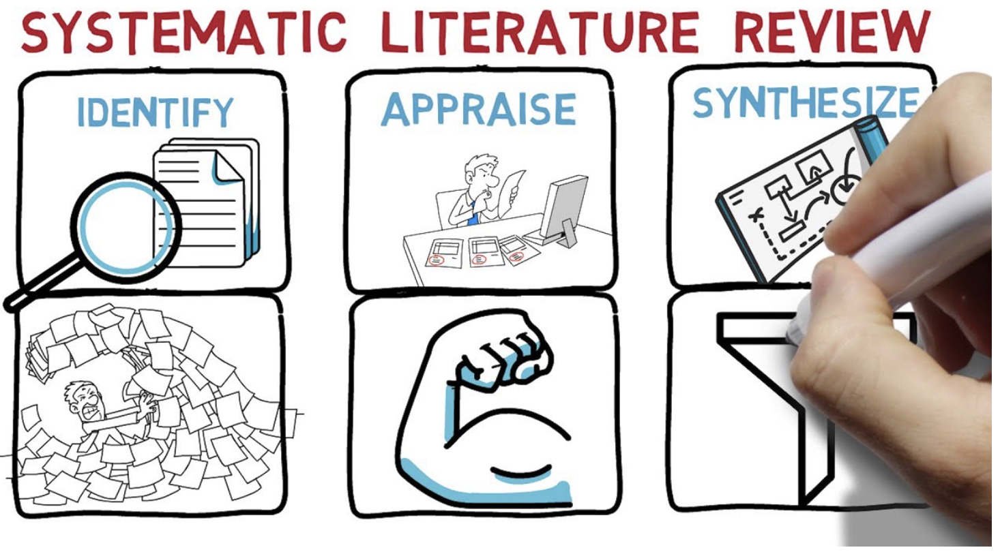

# 👋 Welcome!

<figure><figcaption></figcaption></figure>

Computer science is a dynamic and rapidly evolving field at the forefront of technological advancement. This systematic literature review (SLR) offers a comprehensive analysis of recent research in computer science, providing insights into the state of the field as of 2025.

Utilizing a systematic approach, this review encompasses a wide spectrum of computer science subdisciplines, including artificial intelligence, machine learning, software engineering, cybersecurity, and data science. By employing predefined inclusion criteria and a methodical search strategy, a diverse selection of scholarly publications is analyzed.

Key findings from this SLR reveal emerging themes, challenges, and innovative approaches within computer science research. These may encompass breakthroughs in deep learning algorithms, advancements in quantum computing, novel software development paradigms, and strategies for enhancing cybersecurity in an increasingly interconnected world.

Furthermore, this review sheds light on the methodological diversity present in the selected studies, highlighting the various research methodologies employed across different domains within computer science.

This SLR serves as a valuable resource for researchers, educators, and practitioners seeking a comprehensive understanding of the current landscape of computer science research. It not only summarizes recent developments but also offers guidance for future research directions, encouraging collaboration and innovation in this ever-evolving field.

A systematic literature review (SLR) is a method to synthesize scientific evidence on a specific research question in a transparent and rigorous way. It involves the following steps:

* Define the research question and the scope of the review
* Search for relevant studies using predefined keywords and databases
* Select the primary studies based on predefined inclusion and exclusion criteria
* Assess the quality and validity of the selected studies
* Extract and synthesize the data from the studies
* Report and disseminate the findings and implications of the review

SLRs are widely used in medicine and other disciplines, but they are relatively new in computer science. They can help researchers to identify existing solutions, avoid bias, find research gaps, and inform future research directions.

 
